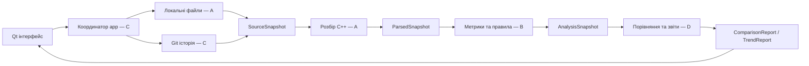

# Code Xray

**Code Xray** — настільний застосунок на C++, який допоможе розібратися у структурі C++ проєкту й побачити, що змінилося між двома версіями. Він збирає результати розбору, метрики та перевірок у звіт, з яким команді зручніше обговорювати зміни.

> Проєкт на початку розробки. Можливості нижче — ціль першої версії, а не обіцянка вже готової програми.

## Для чого він потрібен

Наприклад, після зміни `processOrder()` стала довшою, отримала глибше вкладення, а в іншій функції правило, яке раніше спрацьовувало, більше не порушується. Code Xray має показати ці зміни, дати відкрити код обох версій і зберегти звіт для команди. Метрики допомагають знайти місця для перегляду, але не оголошують код автоматично «поганим».

## Що плануємо у v1

- Відкривати папку або вибрані файли та показувати структуру C++ файлів, типів і функцій.
- Рахувати довжину функції, максимальну вкладеність і кількість розгалужень за узгодженими правилами.
- Дозволяти налаштовувати профіль перевірок і переглядати порушення з посиланням на код.
- Читати локальну Git-історію без зміни робочої папки й порівнювати результати для двох комітів.
- Показувати зміни метрик і правил, будувати простий тренд та експортувати HTML і JSON звіт.
- Виконувати довгі операції без зависання інтерфейсу, показувати прогрес і підтримувати скасування.

У v1 аналіз є синтаксичним: застосунок не компілює цільовий код, не розгортає макроси й не доводить його коректність. Автоматичне виправлення, оцінювання програмістів і розпізнавання перейменованих функцій не входять у першу версію.

## Технології

Початковий стек: **C++20, Qt 6 Widgets, CMake, Tree-sitter із граматикою C++, libgit2, nlohmann/json та inja**. Перша платформа збірки — Windows x64. Точні сумісні версії залежностей зафіксуємо разом із першим відтворюваним build-процесом; до цього часу інструкція збірки ще формується.

## Будова застосунку

Кожен модуль має свою відповідальність, а координатор `app` викликає їх у визначеному порядку:

| Учасник | Модуль | Відповідальність |
|---|---|---|
| A — `chillsmurfkkk` | `code` | Джерела файлів, структура C++ і синтаксичний розбір. Також навігаційний каркас вікна. |
| B — `Kolya0685` | `analysis` | Метрики, профілі, правила та пояснення порушень. |
| C — `kostukoleksandr` | `history`, `app` | Git-історія, знімки файлів і координація фонових операцій. |
| D — `Knuuniacc` | `review` | Зіставлення версій, тренди, HTML/JSON звіти. |

## Домовленості між модулями

- Дані проходять в одному напрямку: `SourceSnapshot` → `ParsedSnapshot` → `AnalysisSnapshot` → `ComparisonReport`. Модулі не викликають один одного по колу; їхню послідовність визначає `app`.
- Спільні результати — звичайні типізовані C++ типи. Не передаємо між модулями `TSNode`, вказівники libgit2, `QWidget` або універсальний JSON.
- Знімок містить незмінні вхідні дані. Шляхи в ньому відносні з `/`; байтові діапазони — напіввідкриті `[start, end)`, рядки для показу в GUI починаються з 1.
- Помилка має код, повідомлення й контекст. Частковий результат, невідоме значення та скасування відрізняються від успішного порожнього результату.
- Парсер, Git і аналіз працюють поза GUI-потоком; віджети змінюються лише в головному потоці.
- Для порівняння обидві версії аналізуються з однаковими правилами, фільтрами та профілем. За несумісних параметрів програма пояснює, чому порівняння неможливе.

Цей README — спільне джерело актуальних технічних домовленостей команди. Перед реалізацією модулів команда фіксує їхні спільні типи й невеликі контрольні приклади. Якщо змінюється спільний контракт, автор узгоджує зміну з усіма модулями-споживачами, а потім оновлює README разом із кодом і прикладами в тому самому PR.

## Як долучатися

`main` захищена: робота йде в окремій гілці та повертається через pull request. Для злиття потрібне схвалення іншого учасника; використовується **Rebase and merge**, щоб окремі змістовні коміти лишалися видимими в історії. Автор комітить зі своїм GitHub-акаунтом і просить власника сусіднього модуля рано переглянути зміни спільного контракту.

Перша спільна ціль — відтворювана збірка й затверджені інтерфейси модулів. Після цього команда збирає наскрізний сценарій: **два Git-коміти → розбір функцій → метрика довжини → різниця → перегляд коду**.
